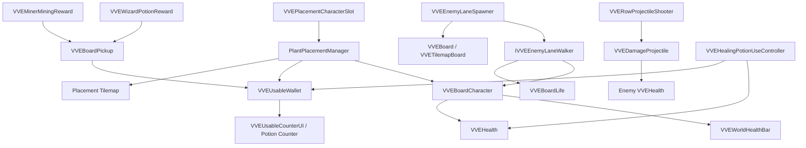

# Architecture

This document maps the current runtime systems in the Vikings vs Everyone Unity project.

## High-Level Runtime Flow

1. `VVEUsableWallet` initializes diamonds and healing potions.
2. `PlantPlacementManager` listens for mouse/keyboard input.
3. Character slot clicks select a `VVEPlacementCharacterSlot`.
4. Board clicks spend diamonds and instantiate the selected character prefab.
5. Spawned defenders receive/keep `VVEBoardCharacter`, which records cell and sorting state.
6. `VVEEnemyLaneSpawner` builds lane start/end points from the board and periodically spawns enemies.
7. Enemies implement `IVVEEnemyLaneWalker`, walk their assigned lane, attack defenders, and damage board life if they exit.
8. Combat and pickups update health, wallet resources, counters, and world health bars.

## System Map

## Board Layer

### `VVEBoard`

Prefab-board helper with explicit rows, columns, spacing, and `VVETile` references. It can return world positions and place occupants into tile references.

### `VVETile`

Stores row, column, and a current occupant reference for prefab-board placement.

### `VVETilemapBoard`

Tilemap-board helper that finds its `Grid` and `Tilemap`, checks tile occupancy, and converts cells to centered world positions. This is useful for tilemap-authored boards.

### `VVEBoardCharacter`

Runtime metadata attached to placed defenders:

- stores the assigned cell
- exposes `HasCell`
- ensures/links `VVEHealth`
- sets max health on enable
- applies row-based `SortingGroup` ordering

### `VVEBoardLife`

Represents the chest/base health. Enemies call `TryDamageActiveBoardLife` when they leak through a lane.

## Placement Layer

### `PlantPlacementManager`

The main input coordinator for board-defense mode. Despite the name, it handles character placement.

Responsibilities:

- select character slots
- validate placement tilemap cells
- spend diamonds
- instantiate selected character prefabs
- maintain an occupied-cell dictionary
- create placement previews
- collect board pickups
- route healing potion clicks
- remove placed characters

Important defaults:

- right click clears selection
- `X` toggles remove mode
- `Left Shift` temporarily activates remove mode

### `VVEPlacementCharacterSlot`

Scene component for character shop slots. It stores:

- character prefab
- diamond cost
- optional cost text
- selection indicator
- selected scale multiplier

Slot cost is scene data. If a prefab gets more powerful, remember to update its slot cost in the scene.

## Economy And UI Layer

### `VVEUsableWallet`

Singleton-style runtime wallet for:

- diamonds
- healing potions

It exposes change events used by UI counters.

### `VVEUsableCounterUI`

Updates TextMeshPro counters from wallet events. It can display diamonds or healing potions depending on `CounterResource`.

### `VVEHealingPotionUseController`

Handles potion count display, potion-counter click detection, aiming mode, target highlighting, cursor ghost rendering, spending potions, and healing damaged board characters.

## Combat Layer

### `VVEHealth`

Shared health model. Other systems should use this instead of custom health when interacting with VVE board entities.

### `VVERowProjectileShooter`

Lane-aware ranged attacker for placed characters.

- Searches all `IVVEEnemyLaneWalker` behaviours.
- Filters by same lane.
- Chooses the closest valid forward target.
- Assigns projectile damage from its own `projectileDamage` field before launch.
- Fires pooled or fresh `VVEDamageProjectile` instances.

### `VVEDamageProjectile`

Projectile behavior for lane combat. It moves in a direction, damages health targets, can apply stun source metadata, and can return to a pool. It checks trigger contacts and also tests the movement segment between the previous and current position so fast projectiles have a better chance to hit enemies.

### `VVEBoardMeleeAttacker`

Lane-aware melee attacker for placed defenders. It stores the target selected when the attack animation starts, then validates or retargets when the animation damage event fires.

### `VVEHitRecoil`

Visual/gameplay hit response:

- recoil movement
- optional return after recoil
- stun trigger support
- random stun chance and resistance
- hit flash
- hit sounds through `VVEAnimationSoundPlayer`

## Enemy Layer

### `IVVEEnemyLaneWalker`

Interface required by lane enemies. The spawner depends on this instead of a concrete enemy class.

### `VVEEnemyLaneSpawner`

Spawns weighted enemy options into random board lanes. It supports both prefab-board and tilemap-board lane construction.

Difficulty ramping lerps from the starting interval/alive cap toward lower interval and higher alive cap over `timeToMaxDifficulty`.

### `VVEEnemyVikingWalker`

Current lane enemy implementation. It walks toward the end of a lane, attacks defenders in the same row, plays an after-kill pause, and damages board life on exit.

## Pickup Layer

### `VVEBoardPickup`

Clickable board pickup for diamonds or healing potions. It has a lifetime timer, collect sound hook, and visual collect effect.

### `VVEThrownPickup`

Animates pickups from a start point to a landing point along a small arc.

### `VVEMinerMiningReward`

Creates diamond pickups, usually from mining animation events.

### `VVEWizardPotionReward`

Creates healing potion pickups, usually from brewing/animation events.

## Legacy Platformer Layer

The repo still has earlier platformer scripts:

- `PlayerController`
- `PhysicsObject`
- `Enemy`
- `AttackBox`
- `Collectable`
- `Door`
- `Breakable`
- `SceneLoadTrigger`
- `PlayerStats`

These are not the core board-defense architecture, but they may still be useful as reference or for older scenes.

## Naming Notes

- `PlantPlacementManager` should eventually be renamed to something like `VVEPlacementManager`.
- `CharPlacementManagement.cs` contains `PlantPlacementManager`, so file/class names do not currently match.
- `Assets/Scenes/Level 1.unity` is the active prototype scene; the recovered play-mode scene is kept as a backup.
- The public working title is Vikings vs Everyone, and runtime classes now use the `VVE` prefix.
